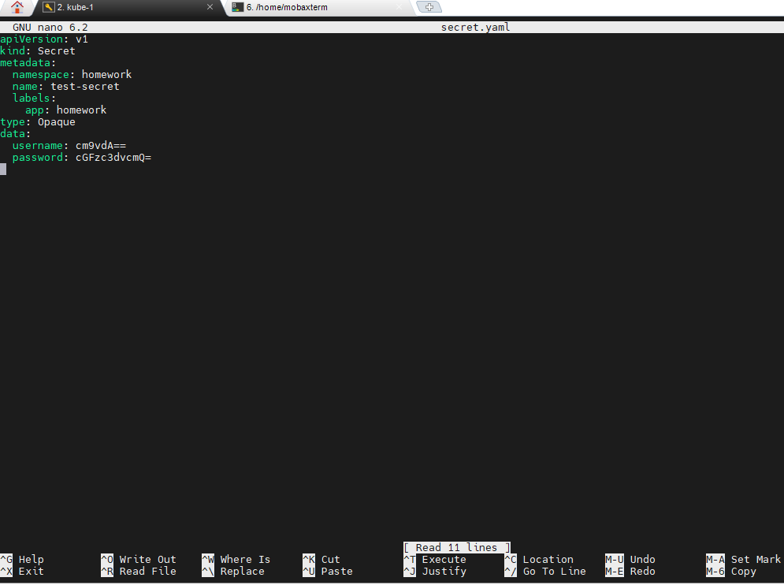
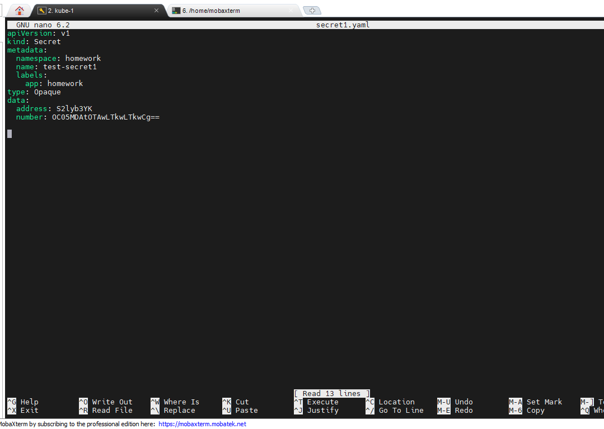
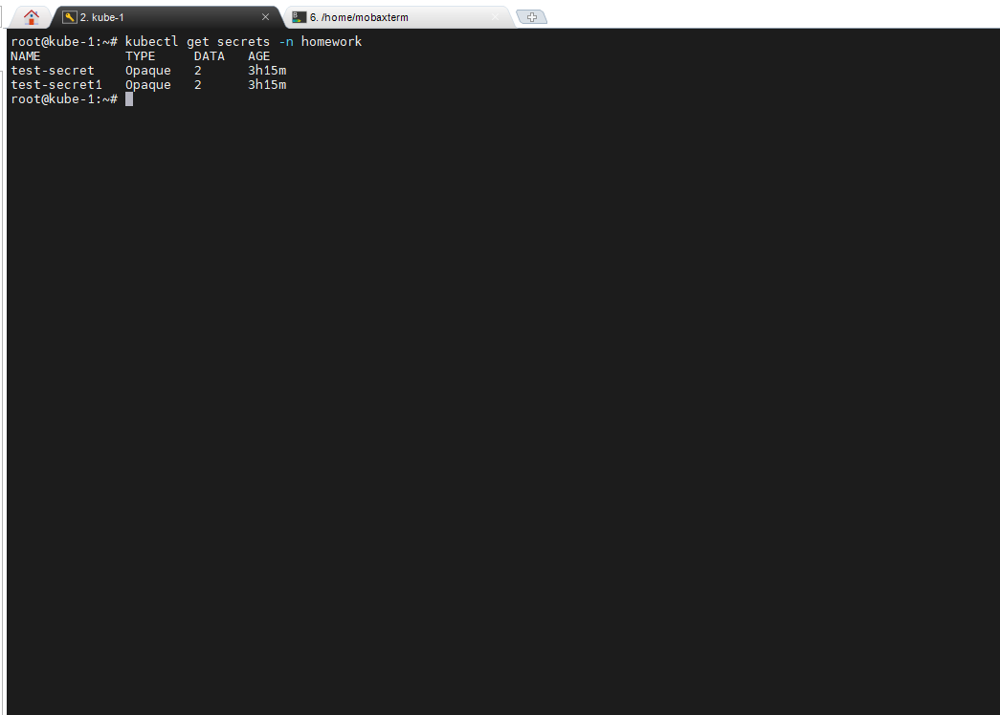
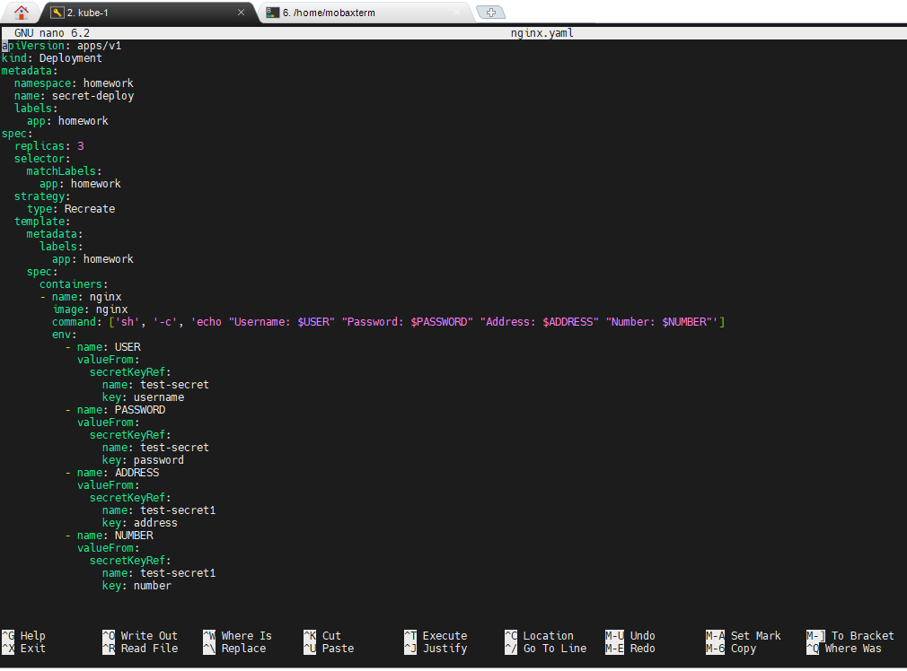
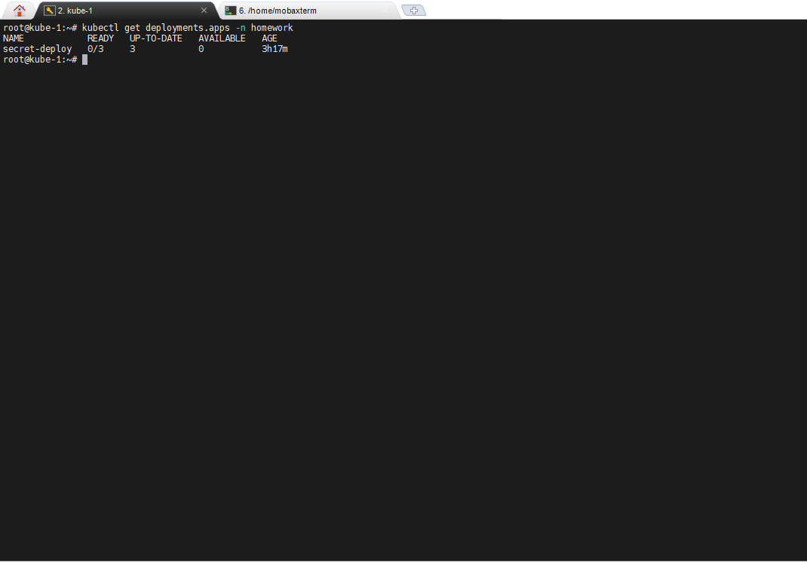
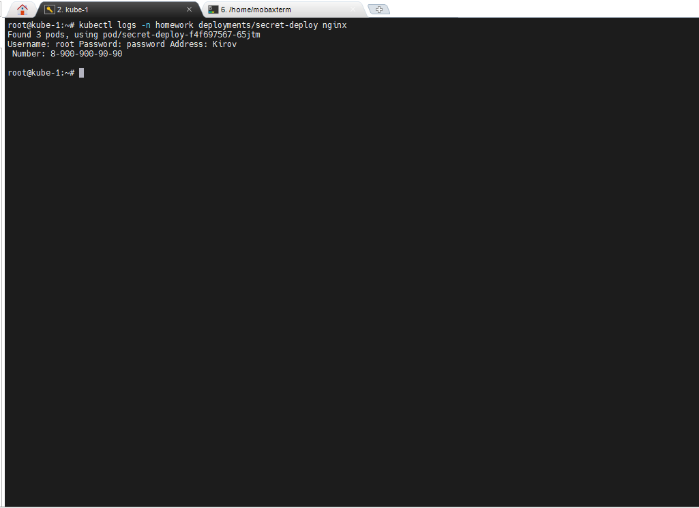

# Создать простой Под (можно использовать тот же, что был на Семинаре). Под должен собирать данные из разных Секретов. Например: username и password брать из одного Секрета, а address и что-то еще (любой параметр) — из другого.

## В первую очередь создадим секреты, с помощью двух разных манифестов

- запустим их поочередной командой **kubeclt apply -f secret.yaml** и соответсвенно **kubeclt apply -f secret.yaml**
- проверим, что секреты созданы командой **kubectl get secrets -n homework**

## Создадим сущность deployment, с помощью манифеста nginx.yaml

- командой **kubectl get deploy -n homework** проверяем что deployment создан.

## Проверяем, что deploy подхавтил секреты из наших файлов **secret.yaml и secret1.yaml** командой *kubectl logs -n homework deployments/secret-deploy nginx*.

.